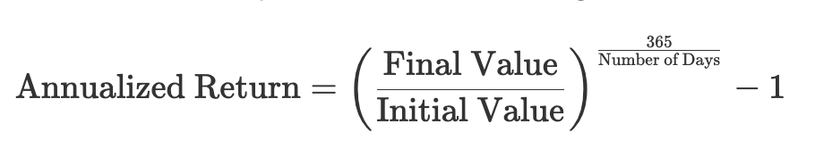

# Challenge

Construct a simple Portfolio class that has a collection of Stocks and a "Profit" method that receives 2 dates and returns the profit of the Portfolio between those dates. Assume each Stock has a "Price" method that receives a date and returns its price.  
**Bonus Track:** Make the Profit method return the "annualized return" of the portfolio between the given dates.

# My Proposal

## Assumptions

- A stock always has a price on a certain date.

## Classes

There are two classes: `Portfolio` and `Stock`, each in its own file. Yes, it’s a really small amount of code, and I don't care. I prefer to maintain clear separation of concerns, so I will never put two classes together in the same file, no matter how small they are. This approach might seem overkill in such a small project, but it's a good habit to develop for larger projects where keeping classes in their own files helps maintain organization and readability.

### `Stock` Class

The `Stock` class is straightforward: it has a name and a dictionary where the keys are dates (as strings) and the values are prices. This allows easy access to the price of the stock on any given date.

- **Attributes**:
  - `name`: The name of the stock.
  - `prices`: A dictionary where each key is a date string and the corresponding value is the price of the stock on that date.

- **Methods**:
  - `price(date)`: Given a date, this method returns the price of the stock on that date. I assume that every date passed to this method will exist in the dictionary, simplifying the implementation.

### `Portfolio` Class

The `Portfolio` class contains a list of `Stock` objects and a method `profit` that, given two dates, will return the simple sum of the differences in prices for each stock between those two dates.

- **Attributes**:
  - `name`: The name of the portfolio.
  - `stocks`: A list of `Stock` objects.

- **Methods**:
  - `add(stocks)`: Adds a list of stocks to the portfolio.
  - `remove(stocks)`: Removes a list of stocks from the portfolio.
  - `profit(start_date, end_date, annualized=False)`: This method is where the core functionality lies. It calculates the profit (or optionally, the annualized return) of the portfolio between the two given dates.

### Bonus

For the annualized profit, I used the following formula:

If it were up to me, I would have put this logic in a separate method. However, given the way the challenge was described, I assumed you wanted this logic integrated into the same method. This is because I'm not a fan of optional arguments that require totally different steps to get to the output.
